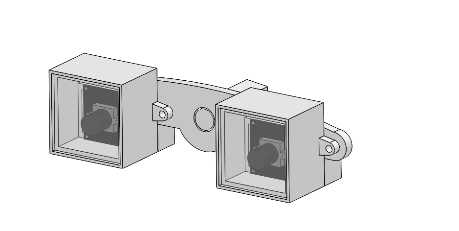
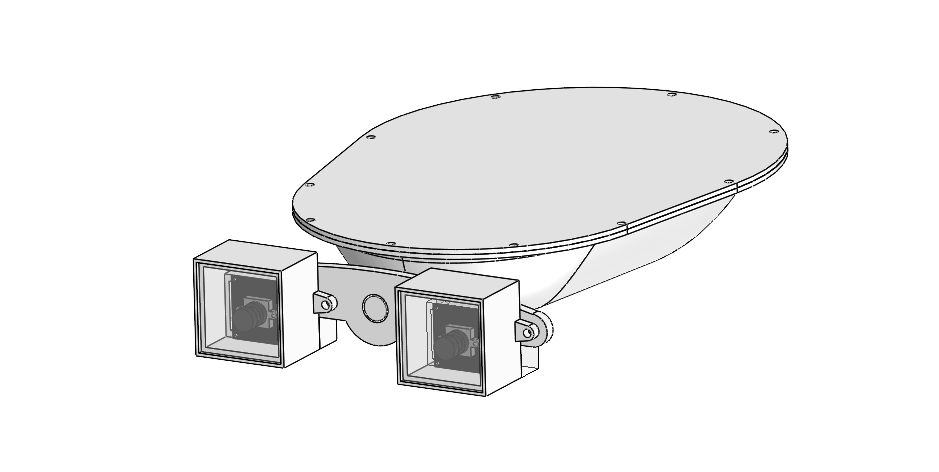

# BeetleBot with a Buoyancy-Driven Rotatable Dual-Camera Device

This repository presents **BeetleBot**, a surface robot inspired by water beetles, equipped with a **Buoyancy-Driven Rotatable Dual-Camera Device**.  
The system enables simultaneous perception of both above-water and underwater environments through a mechanically simple yet effective buoyancy-driven rotation mechanism.

---

## Buoyancy-Driven Rotatable Dual-Camera Device

The working principle of the buoyancy-driven rotatable dual-camera device is illustrated below.

The device utilizes buoyancy to passively rotate a dual-camera structure, allowing the cameras to capture images in both air and water domains without requiring complex actuation mechanisms.

---

## BeetleBot Platform

The BeetleBot platform is shown below.

BeetleBot is a compact robotic platform designed for surface exploration and cross-media perception tasks.

---

## Open-Source Models

The 3D model files are provided in this repository:

- **Dual-Camera Device**: located in the `dual-camera/` folder  
- **BeetleBot Platform**: located in the `BeetleBot/` folder

These models can be used for reproduction, modification, or further research.

